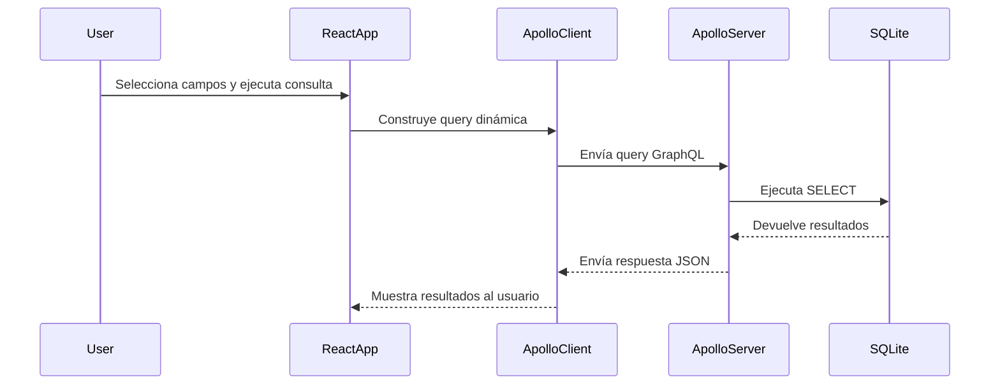

# 🚀 Proyecto Full Stack con GraphQL (React + Apollo + Node.js + SQLite)

Este proyecto implementa una arquitectura **Frontend-Backend** usando **GraphQL** para realizar consultas dinámicas a una base de datos SQLite.
## 🧩 DESPLIEGUE
FRONTEND: https://graphql-two-pink.vercel.app/
BACKEND: https://back-production-98c0.up.railway.app/
## 🧩 Tecnologías

| Componente | Tecnología |
|-------------|-------------|
| Frontend | React + Apollo Client |
| Backend | Node.js + Apollo Server |
| Base de datos | SQLite3 |
| Build Tool | Vite |
| Lenguaje | JavaScript (ES6) |

---

## 📁 Estructura del Proyecto

```
graphql-project/
│
├── backend/
│   ├── server.js          # Servidor GraphQL con Apollo
│   ├── db.js              # Conexión a SQLite y funciones async
│   ├── data.db            # Base de datos local
│
├── frontend/
│   ├── src/
│   │   ├── apolloClient.js
│   │   ├── App.jsx
│   │   ├── FieldSelector.jsx
│   │   └── main.jsx
│   └── .env
│
└── README.md
```

---

## ⚙️ Configuración del Backend

1. **Instalar dependencias:**
```bash
cd backend
npm install
```

2. **Iniciar el servidor GraphQL:**
```bash
node server.js
```

El servidor estará disponible en: `http://localhost:4000`

### Endpoints disponibles
```graphql
query {
  breed(id: 1) {
    id
    name
    origin
  }
}

query {
  students {
    id
    firstName
    email
  }
}
```

---

## 💻 Configuración del Frontend

1. **Instalar dependencias:**
```bash
cd frontend
npm install
```

2. **Crear el archivo .env:**
```env
VITE_GRAPHQL_URL=http://localhost:4000
```

3. **Ejecutar el servidor de desarrollo:**
```bash
npm run dev
```

La aplicación estará disponible en: `http://localhost:5173`

---

## 🧠 Funcionalidades Principales

- Consulta dinámica de razas (breeds) por ID
- Consulta dinámica de estudiantes (students)
- Selección de campos a mostrar desde el frontend
- Comunicación cliente-servidor mediante GraphQL
- Uso de Apollo Client para gestionar el cache y las peticiones

---

## 🔗 Flujo de Comunicación



---

## 📡 Variables de Entorno

### Frontend (.env)
```env
VITE_GRAPHQL_URL=https://back-production-98c0.up.railway.app/
```

### Backend
```env
PORT=4000
```
