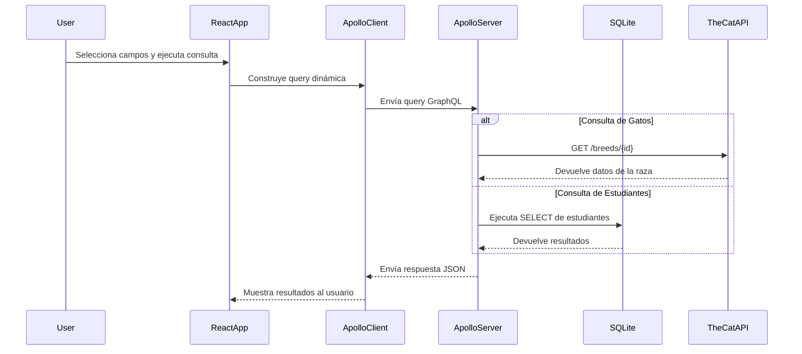

# Taller con GraphQL (React + Apollo + Node.js + SQLite + TheCatAPI)
## Integrantes
Integrantes:

    Juan Andrés Gómez
    Daniel Santiago Ramirez Chinchilla
    Santiago Navarro Cuy

Este proyecto implementa una arquitectura **Frontend-Backend** usando **GraphQL** para realizar consultas dinámicas a:

- **Razas de gatos** vía **TheCatAPI** 
- **Estudiantes** vía **SQLite**

---

## 🧩 DESPLIEGUE

- **FRONTEND**: [https://graphql-two-pink.vercel.app/](https://graphql-two-pink.vercel.app/)  
- **BACKEND**: [https://back-production-98c0.up.railway.app/](https://back-production-98c0.up.railway.app/)

---

## 🧩 Tecnologías

| Componente | Tecnología |
|-------------|-------------|
| Frontend | React + Apollo Client |
| Backend | Node.js + Apollo Server |
| Base de datos | SQLite3 |
| API Externa | TheCatAPI |
| Build Tool | Vite |
| Lenguaje | JavaScript (ES6) |

---

## 📁 Estructura del Proyecto

```
graphql-project/
│
├── backend/
│   ├── server.js          # Servidor GraphQL con Apollo (TheCatAPI + SQLite)
│   ├── db.js              # Conexión a SQLite y funciones async
│   ├── data.db            # Base de datos local
│
├── frontend/
│   ├── src/
│   │   ├── apolloClient.js
│   │   ├── App.jsx
│   │   ├── FieldSelector.jsx
│   │   └── main.jsx
│   └── .env
│
└── README.md
```

---

## ⚙️ Configuración del Backend

1. **Instalar dependencias:**
```bash
cd backend
npm install
npm install node-fetch dotenv
```

2. **Crear el archivo `.env`** con tu API Key de TheCatAPI:
```env
PORT=4000
CAT_API_KEY=tu_api_key_de_thecatapi
```

3. **Iniciar el servidor GraphQL:**
```bash
node server.js
```

El servidor estará disponible en: `http://localhost:4000`

### 🔌 Endpoints GraphQL Disponibles

```graphql
# Consulta una raza de gato por ID (ej: abys, beng, sphy)
query {
  breed(id: "abys") {
    id
    name
    origin
    lifeSpan
    temperament
    description
  }
}

# Consulta todos los estudiantes
query {
  students {
    id
    firstName
    lastName
    email
    age
  }
}
```

---

## 💻 Configuración del Frontend

1. **Instalar dependencias:**
```bash
cd frontend
npm install
```

2. **Crear el archivo `.env`:**
```env
VITE_GRAPHQL_URL=https://back-production-98c0.up.railway.app/
```

3. **Ejecutar el servidor de desarrollo:**
```bash
npm run dev
```

La aplicación estará disponible en: `http://localhost:5173`

---

## 🧠 Funcionalidades Principales

- ✅ Consulta dinámica de **razas de gatos** desde **TheCatAPI**
- ✅ Consulta dinámica de **estudiantes** desde **SQLite** 
- ✅ Selección de campos a mostrar desde el frontend
- ✅ Comunicación cliente-servidor mediante **GraphQL**
- ✅ Uso de **Apollo Client** para gestionar cache y peticiones
- ✅ **Doble fuente de datos** (API externa + base de datos local)

---

## 🔗 Flujo de Comunicación



---

## 📡 Variables de Entorno

### Frontend (.env)
```env
VITE_GRAPHQL_URL=https://back-production-98c0.up.railway.app/
```

### Backend (.env)
```env
PORT=4000
CAT_API_KEY=tu_api_key_de_thecatapi
```

---

## 🐱 Ejemplos de IDs de Razas de Gatos

| ID | Raza | Origen |
|----|------|--------|
| `abys` | Abyssinian | Egipto |
| `beng` | Bengal | Estados Unidos |
| `siam` | Siamese | Tailandia |
| `pers` | Persian | Irán |
| `mcoo` | Maine Coon | Estados Unidos |
| `sphy` | Sphynx | Canadá |

---
